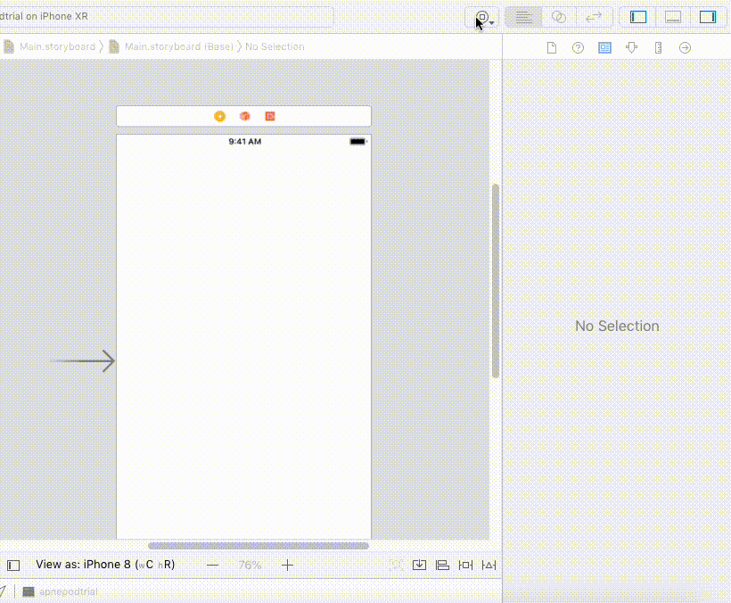

# GradientGraphView

Gradient graph view is a custom view to show analytical data in form of Graph.

### Prerequisites
1. Xcode 9+
2. ios 11.0+
3. swift 4+
4. Cocopods.

### Installing
Add below line in your pod file:

   pod 'GradientGraphView'

Run pod install

## Usage

Drag A UIView into view of your view controller, assign it custom class GraphView to view.

## License

This project is licensed under the MIT License - see the [LICENSE.md](LICENSE.md) file for details

